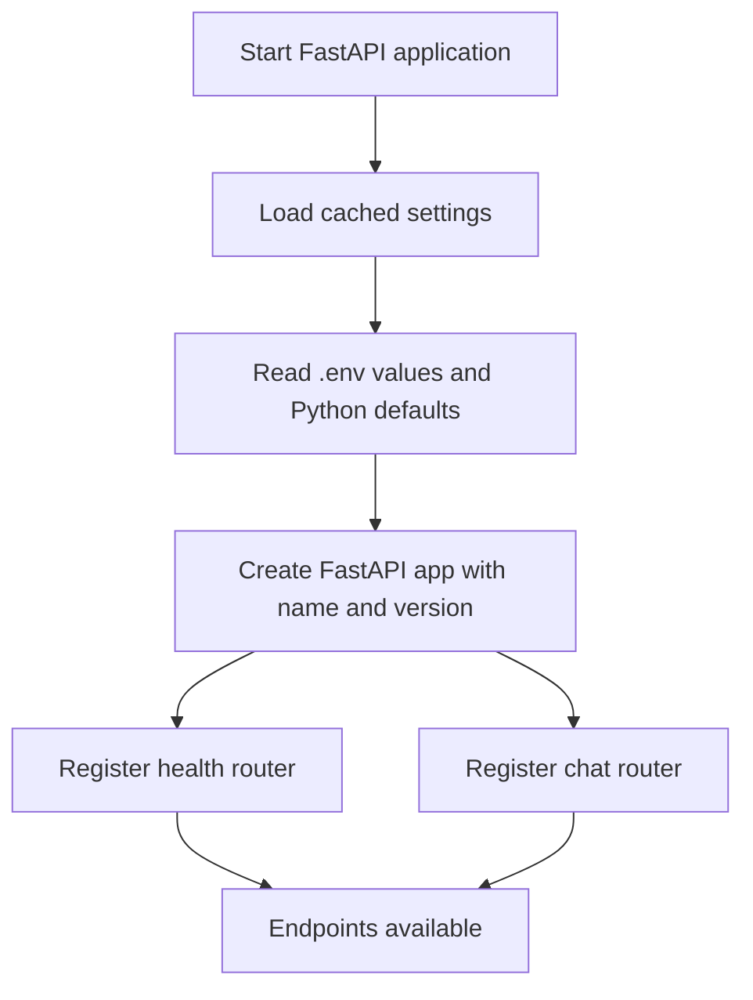
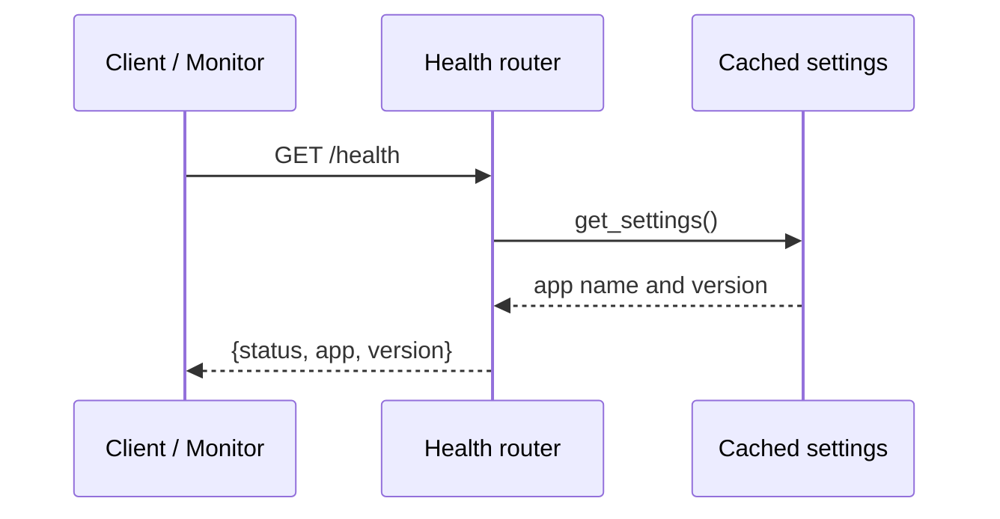
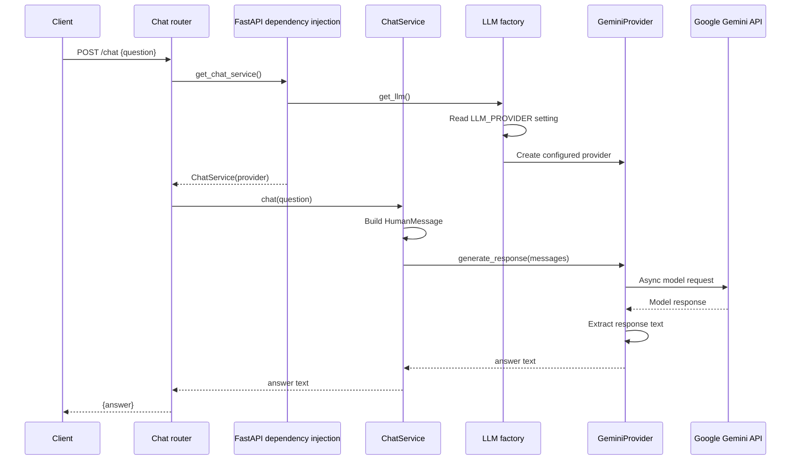
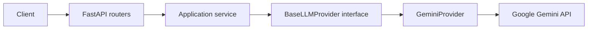
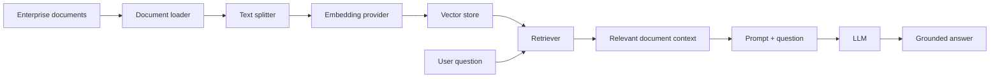

# Sprint 1 & 2: FastAPI Foundation and LLM Integration

## Purpose

Trader Intelligence AI Copilot (TIAC) currently provides a small, well-separated API foundation for asking an LLM a question. The goal of this stage is not Retrieval-Augmented Generation (RAG) yet. It is to establish an API, configuration system, dependency-injection boundary, and LLM-provider abstraction that later features can build on.

## Project flow so far

There are two active flows: application startup and a chat request.

### 1. Application startup



The entry point is `api/main.py`. It calls `get_settings()` once to set the FastAPI title and version, then registers the `/health` and `/chat` routers.

### 2. Health-check request



This endpoint does not check database or LLM connectivity yet. It confirms that the API process is running and can load its basic configuration.

### 3. Chat request: the active LLM workflow



In beginner terms, the router receives HTTP data, `ChatService` coordinates the work, and `GeminiProvider` knows how to talk to Gemini. Each layer has one responsibility, so the application stays easier to test and extend.

## Current request path in code

| Step | Code location | What it does |
| --- | --- | --- |
| Receive request | `api/routers/chat.py` | Validates `{"question": "..."}` with `ChatRequest`. |
| Assemble dependencies | `api/dependencies.py` | Creates a `ChatService` with the configured LLM provider. |
| Choose provider | `llm/factory.py` | Reads `LLM_PROVIDER`; Gemini is the only implemented choice today. |
| Apply chat behaviour | `application/chat_service.py` | Converts the question to a LangChain `HumanMessage` and delegates it. |
| Call model | `llm/gemini.py` | Builds `ChatGoogleGenerativeAI`, makes the async request, and extracts text. |
| Return response | `schemas/chat.py` | Returns `{"answer": "..."}` as `ChatResponse`. |

Example:

```http
POST /chat
Content-Type: application/json

{"question":"Explain a Random Forest in one sentence."}
```

```json
{
  "answer": "A Random Forest combines many decision trees to make more reliable predictions."
}
```

The exact answer comes from the model and may vary.

## Architecture implemented



The API router does not call Gemini directly. It asks an application service to handle the request, and that service depends on the `BaseLLMProvider` interface rather than on Gemini-specific code.

## Implemented components

### Configuration

The `config/` package uses Pydantic Settings to load values from `.env` and environment variables. It provides typed sections for application details, logging, security, database, credentials, and LLM settings. `get_settings()` caches one `ApplicationSettings` object for the running process.

For the LLM request, these fields matter most:

- `LLM_PROVIDER=gemini`
- `LLM_MODEL=gemini-2.5-flash`
- `LLM_TEMPERATURE=0.2`
- `GEMINI_API_KEY=...`

See `01_configuration-guide.md` for the detailed configuration walkthrough.

### FastAPI API

`api/main.py` creates the application and registers these active endpoints:

| Method | Path | Purpose |
| --- | --- | --- |
| `GET` | `/health` | Returns API status, application name, and version. |
| `POST` | `/chat` | Sends one question to the configured LLM and returns its answer. |

FastAPI also exposes interactive API documentation at `/docs` when the server is running.

### Dependency injection

FastAPI's `Depends(get_chat_service)` keeps object creation outside the router. The router does not know how to build an LLM client; it receives a ready-to-use `ChatService` instead.

### LLM abstraction and factory

`BaseLLMProvider` defines the shared contract: `generate_response(messages) -> str`. `GeminiProvider` is the first implementation. `get_llm()` is the factory that selects the implementation based on configuration.

This is only partially swappable today: the configuration enum lists Gemini, OpenAI, Claude, and Azure OpenAI, but the factory currently implements Gemini only. Choosing another provider raises an `Unsupported LLM provider` error until its provider class and factory branch are added.

### Gemini integration

`GeminiProvider` uses LangChain's `ChatGoogleGenerativeAI`. It reads the configured model, Gemini API key, and temperature, calls the model asynchronously with `ainvoke`, then uses `utils/message_parser.extract_text` to turn the model response into a plain string.

## Project structure at this stage

```text
src/trader_intelligence_ai_copilot/
├── api/                 # FastAPI application, routers, dependencies
├── application/         # Use-case orchestration (ChatService)
├── config/              # Typed environment-based configuration
├── llm/                 # LLM interface, Gemini provider, factory
├── schemas/             # Request and response models
├── utils/               # Response-text parsing helper
├── knowledge/           # Reserved for ingestion; currently placeholders
├── embeddings/          # Reserved for embedding providers; currently placeholders
├── vectorstore/         # Reserved for vector databases; currently placeholders
├── retrieval/           # Reserved for retrieval logic; currently placeholder
├── repositories/        # Reserved for trader-data persistence; currently placeholders
└── scripts/             # Reserved for ingestion commands; currently placeholder
```

## What is intentionally not implemented yet

The repository contains the package structure for the next stages, but the following modules are empty placeholders and are not part of the running request path:

- Knowledge ingestion: document loader, text splitter, metadata, and ingest service
- Embeddings
- Chroma/Pinecone vector stores
- Retrieval
- Trader repositories and PostgreSQL access
- Memory, prompts, guardrails, monitoring, observability, evaluation, and authentication

As a result, `/chat` is currently a direct question-to-Gemini call. It does not retrieve enterprise documents, save conversation history, query trader data, enforce guardrails, or cite sources.

## Design principles used

- **Separation of concerns:** HTTP handling, application logic, provider selection, and Gemini communication live in separate modules.
- **Dependency injection:** routers receive services instead of constructing infrastructure themselves.
- **Interface-based design:** `ChatService` depends on `BaseLLMProvider`, not `ChatGoogleGenerativeAI`.
- **Factory pattern:** provider selection is kept in `llm/factory.py`.
- **Configuration-driven behaviour:** API name, model choice, API credentials, and generation settings are external to the business logic.
- **Async I/O:** the provider calls the model asynchronously, so the server can handle other work while waiting for Gemini.

## Next workflow: RAG pipeline

The next major milestone is knowledge ingestion and retrieval. The intended flow is:



After this is implemented, the chat service will retrieve relevant document chunks before calling the LLM. A later hybrid-retrieval stage can combine that document context with structured trader data from PostgreSQL.

## Practical setup notes

1. Copy `.env.example` to `.env`.
2. Set a valid `GEMINI_API_KEY` before calling `/chat`.
3. Keep `.env` private; API keys and database URLs must never be committed.
4. Run the FastAPI application, open `/docs`, call `/health`, then try `/chat`.

## Current status

Completed:

- Project foundation and modular configuration
- FastAPI application bootstrap
- Health endpoint
- Chat request and response schemas
- Dependency-injected `ChatService`
- LLM provider interface and Gemini implementation
- Gemini-backed `/chat` endpoint

Next milestone: implement the knowledge-ingestion pipeline, embeddings, vector store, and retrieval, then pass retrieved context into `ChatService`.
